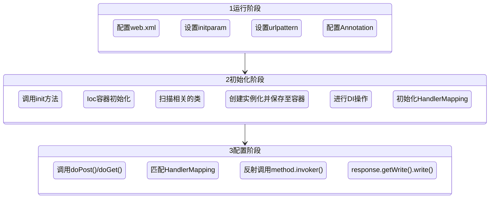

## 手撕Spring
### [源码地址](https://github.com/jihongyun/mini-springmvc)
### 实现思路


### 引入依赖
> servlet-api
```
<dependency>
    <groupId>javax.servlet</groupId>
    <artifactId>javax.servlet-api</artifactId>
    <version>4.0.1</version>
    <scope>provided</scope>
</dependency>
```

>compiler插件
加入编译参数`-parameters`为了反射获取真实的参数名
```
<plugin>
    <groupId>org.apache.maven.plugins</groupId>
    <artifactId>maven-compiler-plugin</artifactId>
    <version>3.8.1</version>
    <configuration>
        <source>1.8</source>
        <target>1.8</target>
        <encoding>UTF-8</encoding>
        <compilerArgs>
            <arg>-parameters</arg>
        </compilerArgs>
    </configuration>
</plugin>
```

>maven-jetty插件
内嵌jetty方便启动servlet服务
```
<plugin>
    <groupId>org.mortbay.jetty</groupId>
    <artifactId>maven-jetty-plugin</artifactId>
    <version>6.1.26</version>
</plugin>
```
### 目录及功能介绍
```
|-- src
    |--main
        |-- cn
            |-- jihongyun
                |-- framework
                    |-- core
                        |-- annotation
                            |-- Autowired.java
                            |-- Controller.java
                            |-- RequestMapping.java
                            |-- ReqeustParam.java
                            |-- Service.java
                        |-- RedCloudDispatcherServlet.java
                |-- demo
                    |-- controller
                        |-- TestController.java
                    |-- service
                        |-- imp
                            |-- TestServiceImp.java
                        |-- TestServcie.java
    |-- resources
        |-- application.properties
    |-- webapp
        |-- WEB-INF
            |-- web.xml
```
- cn.jihongyun.framework.core.annotation中模拟了spring的注解，标记类、方法或参数。
- RedCloudDispatcherServlet.java 实现了HttpServlet中的init(ServletConfig config)、doGet(req,resp)、doPost(req,resp)方法。
- demo文件夹中是一个单元测试

### web.xml配置
```xml
<?xml version="1.0" encoding="UTF-8"?>
<web-app xmlns:xsi="http://www.w3.org/2001/XMLSchema-instance"
         xmlns="http://java.sun.com/xml/ns/j2ee" xmlns:javaee="http://java.sun.com/xml/ns/javaee"
         xmlns:web="http://java.sun.com/xml/ns/javaee/web-app_2_5.xsd"
         xsi:schemaLocation="http://java.sun.com/xml/ns/j2ee http://java.sun.com/xml/ns/j2ee/web-app_2_4.xsd"
         version="2.4">
    <display-name>RedCloud Web Application</display-name>
    <servlet>
        <!--服务名-->
        <servlet-name>redCloudMvc</servlet-name>
        <!--服务的初始化类-->
        <servlet-class>cn.jihongyun.framework.core.RedCloudDispatcherServlet</servlet-class>

        <init-param>
            <param-name>contextConfigLocation</param-name>
            <param-value>application.properties</param-value>
        </init-param>
        <load-on-startup>1</load-on-startup>
    </servlet>
    <servlet-mapping>
        <servlet-name>redCloudMvc</servlet-name>
        <url-pattern>/*</url-pattern>
    </servlet-mapping>
</web-app>
```
### 自定义配置文件application.properties
```
scanPackage=cn.jihongyun.demo
```
### 初始化阶段 `init(ServletConfig config)`

```java
// 加载配置配置
doLoadConfig(config.getInitParameter("contextConfigLocation"));
//扫描相关类信息
doScanner(properties.getProperty("scanPackage"));
//实例化保存至容器中
doInstance();
//完成依赖注入
doAutowired();

//初始化HandlerMapping
initHandlerMapping();
log.info("RedCloud Spring framework init finished.");
```

#### 加载application.properties文件中的信息
```java
private void doLoadConfig(String contextconfigLocation) {
  InputStream resourceAsStream = this.getClass().getClassLoader().getResourceAsStream(contextconfigLocation);
    try {
        properties.load(resourceAsStream);
    } catch (IOException e) {
        e.printStackTrace();
    }finally {
        if (null != resourceAsStream) {
            try {
                resourceAsStream.close();
            } catch (IOException e) {
                e.printStackTrace();
            }
        }
    }
}    
```
#### 获取需要扫描的包路径
```java
    private void doScanner(String scanPackage) {
        URL url = this.getClass().getClassLoader().getResource("/" + scanPackage.replaceAll("\\.", "/"));
        if (url == null) {
            log.info("scanPackage no exits.");
            return;
        }
        File parent = new File(url.getFile());

        for (File file : parent.listFiles()) {
            if (file.isDirectory()) {
                doScanner(scanPackage+"."+file.getName());
            } else {
                if (!file.getName().endsWith(".class")) {
                    continue;
                }
                String classname = scanPackage + "." + file.getName().replace(".class", "");
                classNames.add(classname);
            }
        }
    }
```
#### 实例化容器保存至IOC容器中
```java
    private void doInstance() {
        if (classNames.isEmpty()) {
            return;
        }
        try {
            for (String className : classNames) {
                Class<?> aClass = Class.forName(className);
                if (aClass.isAnnotationPresent(Controller.class)) {
                    Object ins = aClass.newInstance();
                    String beanName = toLowerFirstCase(aClass.getSimpleName());
                    ioc.put(beanName, ins);
                } else if (aClass.isAnnotationPresent(Service.class)){
                    Object instance = aClass.newInstance();
                    Service annotation = aClass.getAnnotation(Service.class);
                    String beanName = annotation.value();
                    if (beanName.equals("")) {
                        beanName = toLowerFirstCase(aClass.getInterfaces()[0].getSimpleName());
                    }
                    ioc.put(beanName, instance);
                }
            }
        } catch (ClassNotFoundException e) {
            e.printStackTrace();
        } catch (InstantiationException e) {
            e.printStackTrace();
        } catch (IllegalAccessException e) {
            e.printStackTrace();
        }
    }    
```
#### 完成依赖注入
```java
    private void doAutowired() {
        if (ioc.isEmpty()) {
            return;
        }
        for (Map.Entry<String, Object> entry : ioc.entrySet()) {
            Field[] fields = entry.getValue().getClass().getDeclaredFields();
            for (Field field : fields) {

                if (!field.isAnnotationPresent(Autowired.class)) {
                    continue;
                }

                String beanName = toLowerFirstCase(field.getType().getSimpleName());

                // 暴力访问，强制赋值
                field.setAccessible(true);
                try {
                    // 通过反射，动态给字段赋值
                    field.set(entry.getValue(),ioc.get(beanName));
                } catch (IllegalAccessException e) {
                    e.printStackTrace();
                }
            }
        }
    }
```

#### 初始化requestMapping请求规则
```java
    private void doDispatcher(HttpServletRequest req, HttpServletResponse resp) throws IOException, InvocationTargetException, IllegalAccessException {
        //根据请求获取对应处理的handler
        Handler handler = getHandler(req);
        if (handler == null) {
            resp.getWriter().write("404 Not Found!!!");
            return;
        }
        
        // 获取方法的参数类型并赋值
        Class<?>[] paramType = handler.getParamType();
        Object[] paramValues = new Object[paramType.length];
        Map<String, String[]> reqParameterMap = req.getParameterMap();
        for (Map.Entry<String, String[]> param : reqParameterMap.entrySet()) {
            String value = Arrays.toString(param.getValue()).replaceAll("\\[|\\]", "").replaceAll("\\s", ",");
            if (!handler.paramIndexMapping.containsKey(param.getKey())) {
                continue;
            }
            Integer index = handler.paramIndexMapping.get(param.getKey());
            paramValues[index] = convert(paramType[index], value);
        }
        if (handler.paramIndexMapping.containsKey(HttpServletRequest.class.getName())) {
            Integer reqIndex = handler.paramIndexMapping.get(HttpServletRequest.class.getName());
            paramValues[reqIndex] = req;
        }
        if (handler.paramIndexMapping.containsKey(HttpServletResponse.class.getName())) {
            Integer respIndex = handler.paramIndexMapping.get(HttpServletResponse.class.getName());
            paramValues[respIndex] = resp;
        }
        // 反射调用返回结果
        Object returnValue = handler.method.invoke(handler.controller, paramValues);
        if (returnValue == null || returnValue instanceof Void) {
            return;
        }
        resp.getWriter().write(returnValue.toString());
    }
```
### 请求匹配处理阶段
此阶段根据请求路径获取对应的处理方法，反射调用，返回结果。
```java
    private void doDispatcher(HttpServletRequest req, HttpServletResponse resp) throws IOException, InvocationTargetException, IllegalAccessException {
        //根据请求获取对应处理的handler
        Handler handler = getHandler(req);
        if (handler == null) {
            resp.getWriter().write("404 Not Found!!!");
            return;
        }
        // 获取方法的参数类型并赋值
        Class<?>[] paramType = handler.getParamType();
        Object[] paramValues = new Object[paramType.length];
        Map<String, String[]> reqParameterMap = req.getParameterMap();
        for (Map.Entry<String, String[]> param : reqParameterMap.entrySet()) {
            String value = Arrays.toString(param.getValue()).replaceAll("\\[|\\]", "").replaceAll("\\s", ",");
            if (!handler.paramIndexMapping.containsKey(param.getKey())) {
                continue;
            }
            Integer index = handler.paramIndexMapping.get(param.getKey());
            paramValues[index] = convert(paramType[index], value);
        }
        if (handler.paramIndexMapping.containsKey(HttpServletRequest.class.getName())) {
            Integer reqIndex = handler.paramIndexMapping.get(HttpServletRequest.class.getName());
            paramValues[reqIndex] = req;
        }
        if (handler.paramIndexMapping.containsKey(HttpServletResponse.class.getName())) {
            Integer respIndex = handler.paramIndexMapping.get(HttpServletResponse.class.getName());
            paramValues[respIndex] = resp;
        }
        // 反射调用返回结果
        Object returnValue = handler.method.invoke(handler.controller, paramValues);
        if (returnValue == null || returnValue instanceof Void) {
            return;
        }
        resp.getWriter().write(returnValue.toString());
    }
```
### 总结
通过demo简单模仿了SpringMVC，了解SpringMVC整个调用链路。
